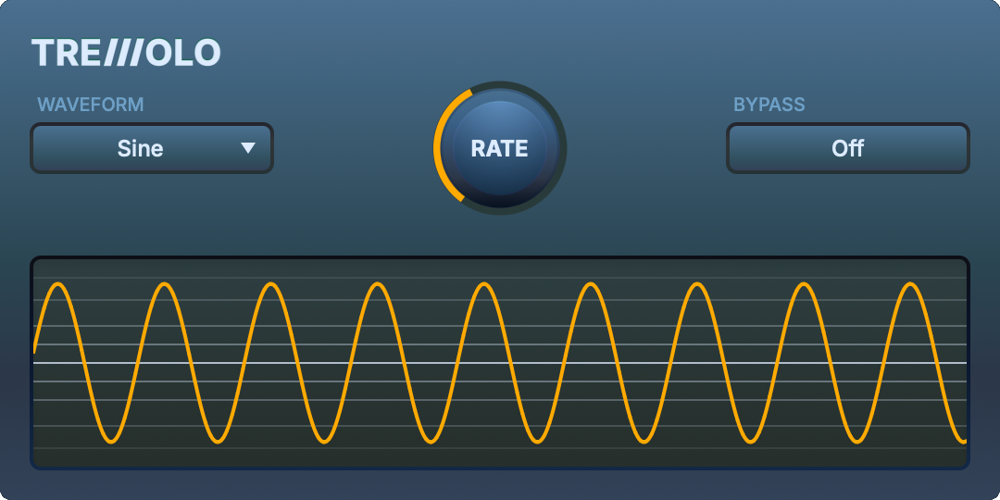

<div align="center">

# Tremolo Audio Plugin



Tremolo audio plugin project used for the Official JUCE Audio Plugin Development Course.


</div>

## Requirements

You need to have the following software installed your machine:

* Git version control system
* CMake 3.25 or higher (the one bundled with CLion 2025.1.1 or higher should work)
* C++ compiler and build system. Tested on:
  * macOS: Xcode 15.4 (Apple Clang 15.0.0.15000309), 16.4 (Apple Clang 17.0.0.17000013)
  * Windows: Visual Studio 2022 17.14.13 (MSVC 19.44.35215)
  * Ubuntu, Debian: gcc 12.2.0, 13.3.0 and make 4.3

## Getting Started

**Detailed information on the setup process is described in the course.**

1. Click “Use this template” on GitHub to create your own copy and begin your project.
2. Clone **your repository** locally.
3. Build the *complete/* plugin
   1. Open the *complete/* folder in CLion, or
   2. In the main repo directory execute

      ```bash
      cd complete
      cmake --preset default
      cmake --build --preset default
      ```

The first build will take the most time because the dependencies (CPM and JUCE) need to be downloaded.

## Structure

This repository is a template. Click “Use this template” on GitHub to create your own copy and begin your project.

The plugin project is present in two folders:

* *complete/* contains the completed tremolo plugin project. It compiles and runs out of the box.
* *todo/* contains skeleton code of the same plugin. This is the code you will work on throughout the course to gradually bring it to the same state as the *complete/* folder. In its default state, it does not compile.

## License

We use the incredibly liberal ["Unlicense" license](LICENSE.md). You can basically do whatever you want with the code. Remember that the commercial use of products built with JUCE requires a JUCE license. Refer to the JUCE license for details.
